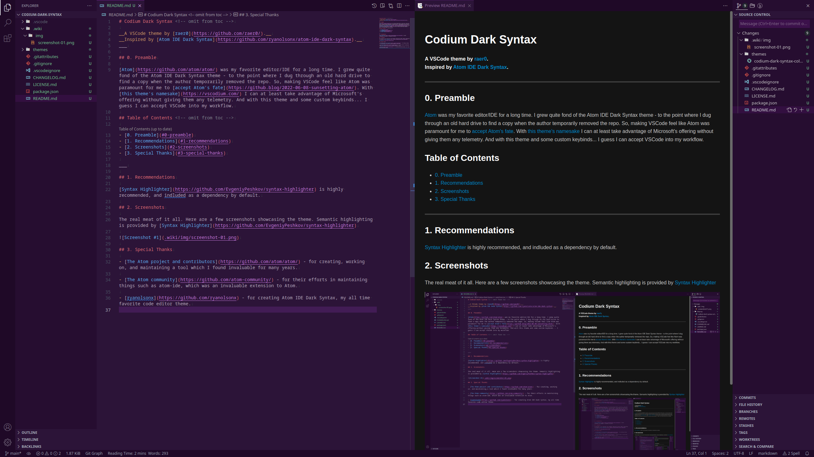

# Codium Dark Syntax <!-- omit from toc -->

__A VSCode theme by [raer0](https://github.com/raer0/).__

__Inspired by [Atom IDE Dark Syntax](https://github.com/ryanolsonx/atom-ide-dark-syntax).__
___

## 0. Preamble

[Atom](https://github.com/atom/atom/) was my favorite editor/IDE for a long time. I grew quite fond of the Atom IDE Dark Syntax theme - to the point where I dug through an old hard drive to find a copy when the author temporarily removed the repo. So, making VSCode feel like Atom was paramount for me to [accept Atom's fate](https://github.blog/2022-06-08-sunsetting-atom/). With [this theme's namesake](https://vscodium.com/) I can at least take advantage of Microsoft's offering without giving them any telemetry. And with this theme and some custom keybinds... I guess I can accept VSCode into my workflow.

## Table of Contents <!-- omit from toc -->

- [0. Preamble](#0-preamble)
- [1. Recommendations](#1-recommendations)
- [2. Screenshot](#2-screenshot)
- [3. Special Thanks](#3-special-thanks)

___

## 1. Recommendations

[Syntax Highlighter](https://github.com/EvgeniyPeshkov/syntax-highlighter) is highly recommended, and indluded as a dependency by default.

## 2. Screenshot

## 3. Special Thanks

- [The Atom project and contributors](https://github.com/atom/atom/) - for creating, working on, and maintaining a tool which I found invaluable for many years.

- [The Atom community](https://github.com/atom-community/) - for their efforts in maintaining things such as atom-ide, which was an invaluable extension to Atom.

- [ryanolsonx](https://github.com/ryanolsonx) - for creating Atom IDE Dark Syntax, my all time favorite code editor theme.
